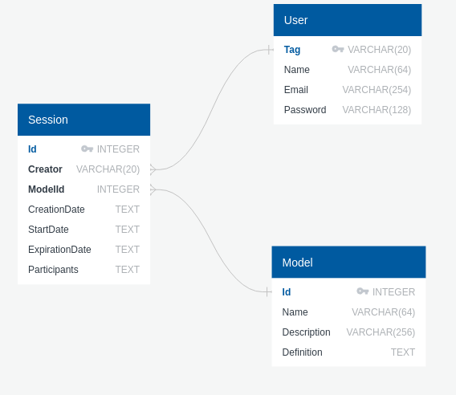

# Instructions

## Database schema


## How to run

 1. Create database
```bash
  sqlite3 rbcml.db < schema.sql
```
2. Run
```bash
  python3 create.py
```
<br>

## Get more info
- [sqlite basics](https://www.sqlitetutorial.net/)
- [sqlite3 Python Documentation](https://docs.python.org/3/library/sqlite3.html)
